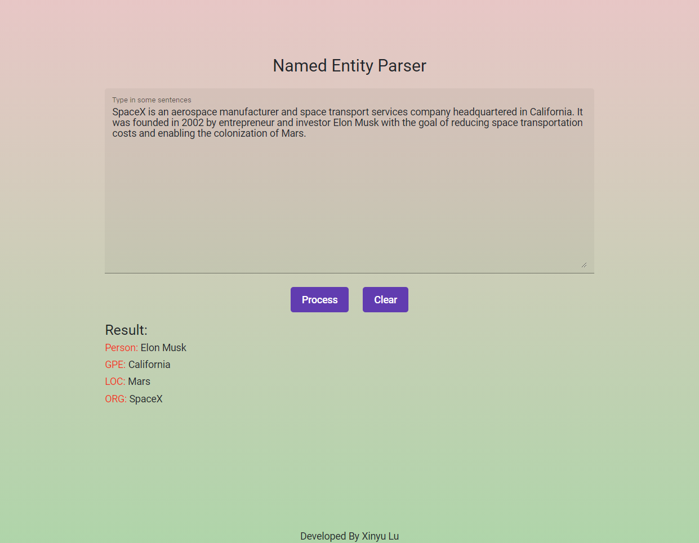

# Web-based named entity recognition

### Description:
This is a named entity recognition web application with [`Angular`](https://angular.io/) frontend and [`Flask`](https://flask.palletsprojects.com/en/2.0.x/) backend. It supports recoginize named entities of PERSON, GPE, LOC and ORG in English. You can type in some sentencess to the text box and click on the process button. The results will be displayed at the section below. Each recognizied word will be classified into four categories. Each category will be displayed if there are words in it. When you click on the clear button, all of text typed in and results generated will be cleared.

### Commands to run the application:
1. Install: `make install`

2. Run Frontend: `make frontend start`

3. Run Backend: `make backend start`

### Deployed links:
This web application has been deployed to [`Google Cloud Platform`](https://cloud.google.com/). You can visit frontend and backend through these links below.

* Frontend: https://web-ner-frontend-xinyu.wl.r.appspot.com/

* Backend: https://web-ner-backend-xinyu.wl.r.appspot.com/

### Screenshot:

